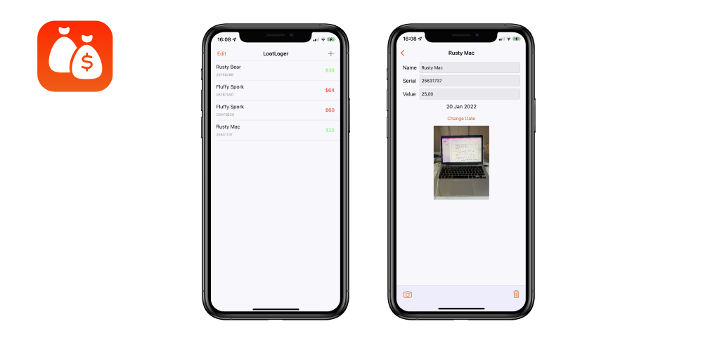

# Loot Logger
app for log your belongings

<!-- PROJECT LOGO -->
 

  

<!-- ABOUT THE PROJECT -->
## About The Project

this app in case you have a fire at home or a stealing is a great tool to keep a log of your belongings and make a report ready to go.

(<a href="#top">back to top</a>)

### Built With

* UIKit
* Table Views
* UIImagePickerController
* NSCache
* NotificationCenter
* FileManager

(<a href="#top">back to top</a>)

<!-- Things I learned -->
## Things I learned

* Work with Table View
* Usage of MVC pattern, and properties injection
* Work with UIImagePickerController to pick the images
* Usage of FileManager 
* Usage of NSCache to save the images temporarely 

(<a href="#top">back to top</a>)

<!-- CONTRIBUTING -->
## Contributing

Contributions are what make the open source community such an amazing place to learn, inspire, and create. Any contributions you make are **greatly appreciated**.

If you have a suggestion that would make this better, please fork the repo and create a pull request. You can also simply open an issue with the tag "enhancement".
Don't forget to give the project a star! Thanks again!

1. Fork the Project
2. Create your Feature Branch (`git checkout -b feature/AmazingFeature`)
3. Commit your Changes (`git commit -m 'Add some AmazingFeature'`)
4. Push to the Branch (`git push origin feature/AmazingFeature`)
5. Open a Pull Request

(<a href="#top">back to top</a>)

